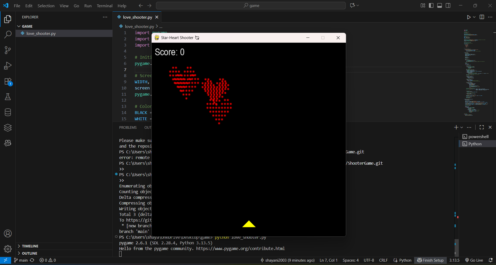
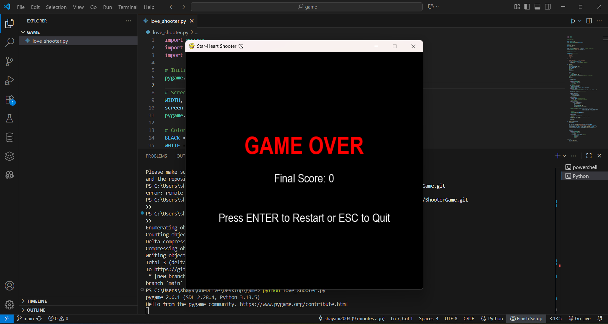

# Star-Heart Shooter 💘

A fun arcade-style shooting game built with **Pygame** where you control a yellow triangle shooter and destroy falling ASCII art hearts made of stars. The game gets harder as your score increases, and it ends if any heart reaches the bottom of the screen.

---

## 🎮 Game Preview

### Gameplay Screenshot



### Game Over Screen



---

## ✨ Features

* ASCII art star-hearts as enemies ❤️
* Yellow triangle shooter controlled by arrow keys 🔺
* Bullets fired using the **SPACEBAR**
* Score tracking displayed at the top-left corner
* Increasing difficulty: hearts fall faster as your score rises
* **Game Over screen** with final score and restart/quit options

---

## 🕹️ Controls

* **Left Arrow (←):** Move left
* **Right Arrow (→):** Move right
* **Spacebar:** Shoot bullets
* **Enter:** Restart game (on Game Over screen)
* **Escape:** Quit game

---

## 🚀 Installation & Setup

1. Install [Python](https://www.python.org/downloads/) (>= 3.10 recommended).
2. Install **Pygame**:

   ```bash
   pip install pygame
   ```
3. Run the game:

   ```bash
   python love_shooter.py
   ```

---

## 📂 Project Structure

```
GAME/
│-- love_shooter.py   # Main game script
│-- README.md         # Project documentation
```

---

## 🧩 How to Play

* Move your shooter left and right to dodge falling hearts.
* Shoot hearts before they reach the bottom.
* Each destroyed heart increases your score.
* The game ends when a heart reaches the bottom.

---

## 🛠️ Built With

* [Python](https://www.python.org/)
* [Pygame](https://www.pygame.org/)

---


